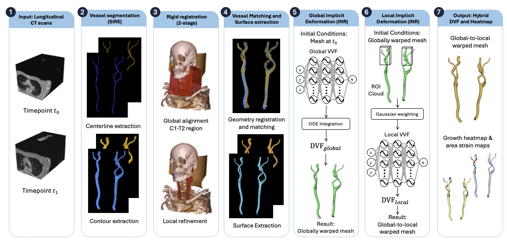
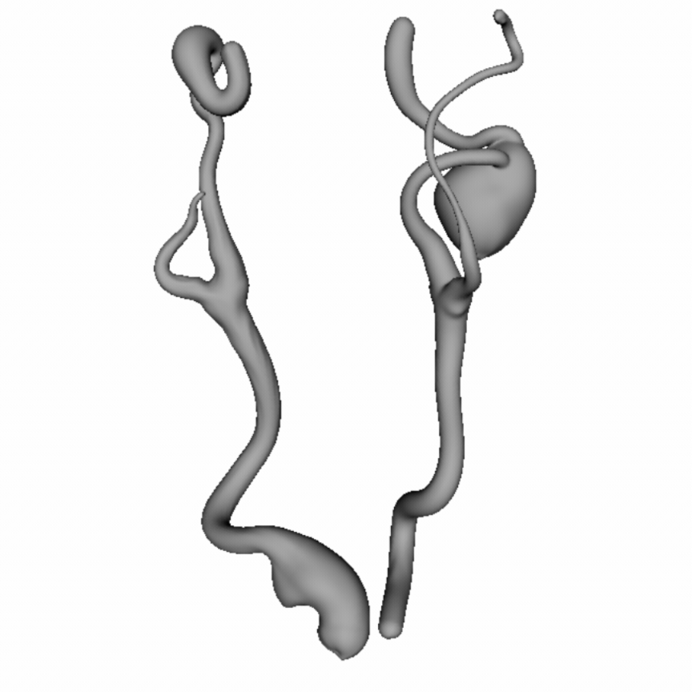

# About this work


This work presents an end-to-end framework for extracranial carotid artery aneurysms (ECAAs) deformation analysis. The presented figure shows an overview of the proposed approach, in which given two CTA scans at different timepoints $t_0$ and $t_1$ (1), the first step is to extract the centerline and contours of the target arteries with the scale-invariant rotation-equivariant framework for vessel tracking and orientation estimation (2). After the extraction of these two priors, an initial two-step rigid registration is performed (3). After centerlines and contours are registered, an INR-based surface reconstruction of the vessels is performed (4). The deformation analysis step is divided in two steps, an initial global deformable registration (5) and a local deformable registration (6). Finally, the results are visualized in two forms: by visualizing the normal-to-surface deformation of each vertex and with area strain maps (7).

### SIRE

The beginning of the pipeline starts with the extraction of the centerlines and contours of the targer vessel, in this case, the carotid arteries. To do this, a scale-invariant rotation-equivariant (SIRE) framework for vessel tracking and orientation estimation is used. View the SIRE code [here](https://github.com/MIAGroupUT/SIRE-segmentation).

After this step, the centerlines and contours are obtained and are going to be used for downstream analysis. Moreover, these two obtained results can be used to generate initial 3D surfaces i.e. using the marching cubes algorithm.

### Multi-stage Registration

The initial two-step rigid registration step is inspired by steps followed in common vascular deformation mapping (VDM). The objective of this step is to align the studies within a common coordinate system to compensate for global positional and orientation differences between the two acquisitions.

The rigid registration consists of a global and a local step. Both registration steps are implemented with the `PatientRegistration` class, this class is located within `utils_image_registration.py`. For class initialization, the following file structure is expected, can be achieved using SIRE:

```bash
Patient/
└── 006/
    ├── 401_NS_NV_NTS/
    │   ├── centerline_correction/
    │   │   ├── centerline_external_carotid_artery_left.vtp
    │   │   └── ...
    │   ├── centerline_raw/
    │   │   └── ...
    │   ├── contour_correction/
    │   │   ├── contour_external_carotid_artery_left.vtp
    │   │   └── ...
    │   ├── contour_raw/
    │   │   └── ...
    │   ├── totalsegmentator/
    │   │   └── ...
    │   └── mesh_correction/   # optional
    │       └── ...
    │
    └── 4_NV_NTS/              # another study
        ├── centerline_correction/
        ├── centerline_raw/
        ├── contour_correction/
        ├── contour_raw/
        ├── totalsegmentator/
        └── mesh_correction/   # optional
```

Example to obtain rigid transform is provided below.
```python
registrator = PatientRegistration(PATH_input,
                                  name_moving_study = moving,         # Folder to moving study data.
                                  name_fixed_study = fixed,           # Folder to fixed study data.
                                  multi_stage_registration = True,    # Two-step registration is enabled.
                                  refinement_side = refinement_side,  # If the second step should focus on any side.
                                  quiet = False)

registrator.save_registered_data(registration_type = 'multistage',    # Saves the registered CTA and TotalSegmentator mask.
                                 register_meshes = True)              # If previously reconstructed.

transforms = registrator.get_transform()         # Contains dictionary with both rigid transforms.
final_transform = transforms["final_transform"]
```

Finally, to align centerlines and contours obtained by SIRE, `register_centerlines_contours` is used as follows.
```python
register_centerlines_contours(PATH_centerlines = path_centerlines,   # Obtained from SIRE.
                              PATH_contours = path_contours,         # Obtained from SIRE.
                              PATH_output = path_output,             # Where data should be saved.
                              final_transform = final_transform)     # Previously obtained transform.
```

### Vessel Matching

The previous step yielded the rigid registered data, however further processing is necessary. For the vessel matching step, the `CarotidVascularModel` class is used, a variation of the code found [here](https://github.com/MIAGroupUT/SIRE-segmentation). Finally after the creation of the two models, `MatchVascularModel`can be used to match centerlines and contours.

```python
vessels = ['external_carotid_artery_left',
           'internal_carotid_artery_left',
           'external_carotid_artery_right',
           'internal_carotid_artery_right']

fixed_model = CarotidVascularModel.load_from_directory(root_dir_centerlines = path_to_fixed_centerlines,
                                                       root_dir_contours = path_to_fixed_contours,
                                                       dir_mask = path_to_totalsegmentator_fixed_mask,
                                                       filenames = vessels)

# The registered moving data is now in path_output used in register_centerlines_contours. Do not use the data
# in the original folder produced by SIRE.
moving_model = CarotidVascularModel.load_from_directory(root_dir_centerlines = path_to_moving_centerlines,
                                                        root_dir_contours = path_to_moving_contours,
                                                        dir_mask = path_to_totalsegmentator_moving_mask,
                                                        filenames = vessels)

MatchVascularModel(series_1 = fixed_model,
                   series_2 = moving_model,
                   split_vessels = False,         # Not recommended, divides into ICA, ECA and CCA. Reconstruction might not be ideal.
                   output_dir = path_matched_data)

```
This step enforces both longitudinal studies to have a similar vessel arc length. While not ensuring a one-to-one correspondance, it greatly prevents foldings over the reconstructed surface during deformation analysis step.

### Hybrid-Parametrization in Vessel Surface Reconstruction.

As mentioned in [Regel et al.](https://arxiv.org/abs/2403.15314) cylindrical coordinate parametrization can be generally used to represent a vessel. Training a model able to estimate such coordinates given a z-position, radius and angle can be used to create an explicit representation of the vessel surface from which the zero-level set can be extracted using the marching cubes algorithm to generate a 3D surface. While this a coordinate system works for most of the cases, for a saccular aneurysms, an spherical parametrization is prefered since the anatomy deviates greatly from the expected cylinder-like shape.

This new parametrization suits better to model the "berry hanging from a tree" nature of the saccular aneurysm.

### Deformation Analysis

The multi-stage deformation is performed in two steps. Given a moving surface (t0) and its target, a fixed surface (t1), first a global deformable registration is performed, this step accounts for artery-wide and most possibly position-related differences. The second step, is an anuerysm-localized deformable registration, aimed to compensate for finer, localized motion. Both of these deformable registrations were implemented using SIREN-based INR, this architecture provides us with simple way to modify the behaviour of the model, the omega parameter inherent to SIREN.

The global registration uses a higher omega than the local registration. For the omega ablation 12 and 5, respectively, shown that the local model was able to generate localized deformation patterns over the anuerysmal region, however, due to lack of quantitive results, these patterns cannot be taken as actual anatomical deformation.

<p align="center">
  
</p>

The multi-stage deformation analysis can be perfomed when 2 comparable meshes are available i.e., meshes generated after the vessel matching. 
